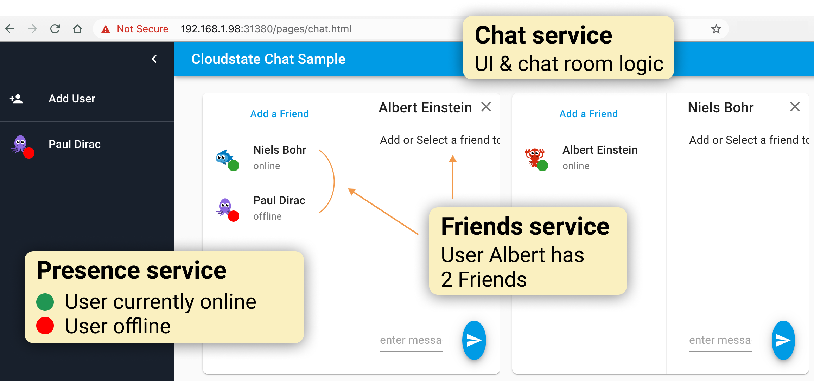
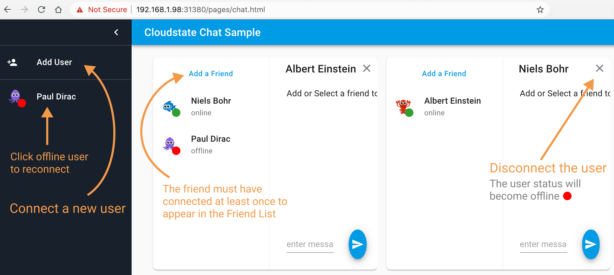

= Cloudstate Sample Chat Application
Lightbend, 2020
Version 2.0, 2020-06-25
:description: Cloudstate Chat Application 
:keywords: Cloudstate, stateful, serverless, chat-sample, tutorial
:sectnums:
:toc:
ifdef::env-github[]
:tip-caption: :bulb:
:note-caption: :information_source:
:important-caption: :heavy_exclamation_mark:
:caution-caption: :fire:
:warning-caption: :warning:
endif::[]

[[cs-chat-sample-overview]]
== Overview

This is a sample application showing an example of using Cloudstate to build a chat application in Node.js. The application consists of three services:

* A stateless service `chat`
* A stateful Entity based service `friends`
* A stateful CRDT based service `presence`

{nbsp} +

[[chatui-navigation-guide]]
The UI is designed to model a chat room where multiple users can connect/disconnect and exchanging chat messages. You simulate the chat room activities in one single browser window. This makes it easy to see the real time interactions, server-side pushes etc, without needing to open many browser tabs. Each user is a separate iframe with a separate websocket connection. The screen below shows the possible actions to interact with the UI.

{nbsp} +

== Code implementation

[horizontal]
chat-ui:: directory containing the code of the stateless service `chat`. This code is written in TypeScript, and run as a Node.js server.
deploy:: directory containing the yaml files to deploy all the services composing the Chat application. The target cluster could be your own Kubernetes cluster or https://docs.lbcs.dev/index.html[Lightbend Cloudstate managed service]

The code of the backend services `Friends` and `Presence` is separate from the UI code. This is intentional to demonstrate the polyglot aspect of Cloudstate services. They can seamlessly interact regardless of the programming language used to implement the service. Below are the available implementations. You can choose any combination for deployment. For example, `Friends` service in Javascript and `Presence` service in Java.

=== JavaScript implementation

* https://github.com/cloudstateio/samples-js-chat/tree/master/friends[Friends service]
* https://github.com/cloudstateio/samples-js-chat/tree/master/presence[Presence service]

=== Java implementation

* https://github.com/cloudstateio/samples-java-chat/tree/master/friends[Friends service]
* https://github.com/cloudstateio/samples-java-chat/tree/master/presence[Presence service]

== Prerequisites

=== Javascript Dev environment

https://github.com/cloudstateio/samples-js-chat/blob/master/README.adoc#js-devenv-setup-for-cloudstate[Javascript Dev environment setup for Cloudstate]

=== Infrastructure

* A Docker repository that the Kubernetes cluster has the necessary credentials to pull from. You can get a free Docker registry at https://hub.docker.com/

For the deployment, there are two possible choices. Below we highlight the main characteristic of each deployment approach. Further details about prerequisites and infrastructure preparation would be discussed further in the <<deployment,Deployment>> section. 

==== Deploy on Lighbend Cloudstate managed service

Basically, all you need is to open an account with Lightbend Cloudstate hosting service. Then install the "Cloudstate CLI" tool and you are good to deploy. There is no need to provide any local infrastructure.

The deployment is as simple as applying the yaml configuration files. Lightbend Cloudstate managed service will take care of the hosting, configuration and maintenance of your service. 

==== Deploy on your own Kubernetes cluster

In case you prefer to host your own services. You need to provide a Kubernetes cluster. This cluster could be local or cloud-based and must fulfill the following requirements:

* A Kubernetes cluster, with 1.13 as the minimum required version
* An ingress controller with a Layer7 Load Balancer ability
* A working knowledge of Kubernetes to be able to manage your cluster and to troubleshoot, should any issue specific to your Kubernetes cluster arise.

== Build Docker images

Before beginning the deployment, the various microservices composing the chat application must be packaged each into their own docker image, and published to your docker registry.

=== Building the Friends & Presence services
* https://github.com/cloudstateio/samples-js-chat/blob/master/friends/README.adoc#building-the-friends-service[Building the Friends service]

* https://github.com/cloudstateio/samples-js-chat/blob/master/presence/README.adoc#building-the-presence-service[Building the Presence service]

=== Building the Chat-UI service

The code below assumes that your docker registry is named `mydockerregistry`. Please replace it with your DockerID (which you have registed at https://hub.docker.com/ as mentioned in <<infrastructure>>

[source,shell]
----
cd ./chat-ui

nvm install
nvm use
npm install
./protogen.sh
npm run prestart
npm run-script build

# let's assume your DockerID in https://hub.docker.com/ is `mydockerregistry`
DOCKER_PUBLISH_TO=mydockerregistry

# build docker image
docker build . -t $DOCKER_PUBLISH_TO/samples-js-chat-ui:latest

# authenticate with your Docker registry
docker login

# push the docker image to your registry
docker push $DOCKER_PUBLISH_TO/samples-js-chat-ui:latest
----

=== Testing the Chat-UI service

In order to make the deployment of the Chat UI consistent with all the other services composing the Chat application. The Node.js server running the UI code is wrapped in a Cloudstate stateless service.

As such, the UI must be accessed via a Cloudstate proxy. The procedure is similar to that of https://github.com/cloudstateio/samples-js-chat/blob/master/friends/README.adoc#testing-friends-service[Testing Friends service]. Which means:

* Start a Cloudstate proxy (docker image prebuilt for us by Cloudstate dev team)
* Start the docker image of the Chat UI we have just built
* Access the UI via the Cloudstate proxy, which expose the Chat-UI service on `http://localhost:9000/pages/chat.html`

[source,shell]
----
# terminal 1: run the cloudstate proxy docker image
# exposing the CS proxy port 9000 to the same 9000 port on the host machine
# NOTE: ignore the connection errors b/c the `user-function` is not yet started
docker run -it --rm --name cloudstate-proxy -p 9000:9000 \
  cloudstateio/cloudstate-proxy-dev-mode \
  -Dcloudstate.proxy.user-function-port=8080 \
  -Dcloudstate.proxy.user-function-interface=samples-js-chat-ui

# terminal 2: run the docker image of the `user-function`
# within the SAME network namespace as the CS proxy
DOCKER_PUBLISH_TO=mydockerregistry

docker run -it --rm --network container:cloudstate-proxy --name js-chat-ui \
  $DOCKER_PUBLISH_TO/samples-js-chat-ui

# terminal 3: use curl (or a browser) to get the Chat-UI home page
curl --silent http://localhost:9000/pages/chat.html | grep -E "<title>.+"

# console output
<title>Cloudstate Chat Example</title>
----

NOTE: The test is successful if the Chat-UI returns an HTML page of the chat room home page. In case you opened the chat homepage in the browser. Please be aware that the chat application itself is NOT YET fully functional. Because the supporting services `Friends` and `Presence` are not yet deployed.

[[deployment]]
== Deployment

We have built, tested and published 3 dockers images of the 3 services: Chat-UI, Friends, Presence. Now we are ready to deploy the Chat application. There are two possible tracks for deploying your service:

. <<docs/deploy-cloudstate-cluster.adoc#,Deploy on Cloudstate cluster>> (Lightbend Cloudstate hosting platform)
. <<docs/deploy-self-hosted.adoc#,Deploy on your own Kubernetes cluster>>

