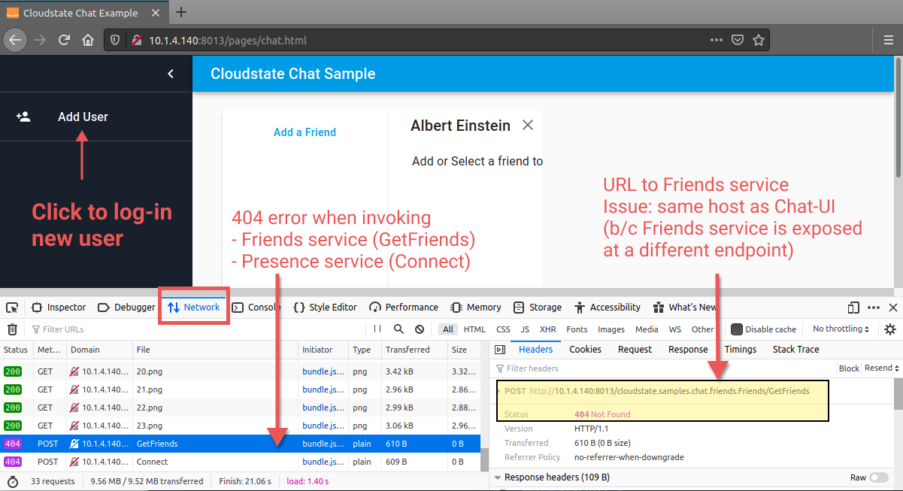
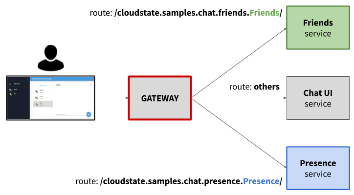
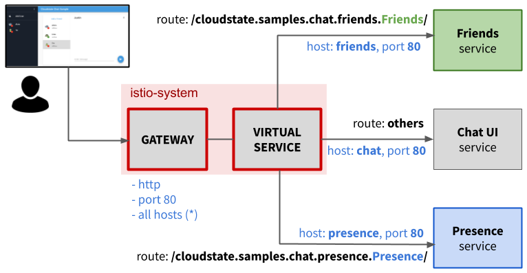
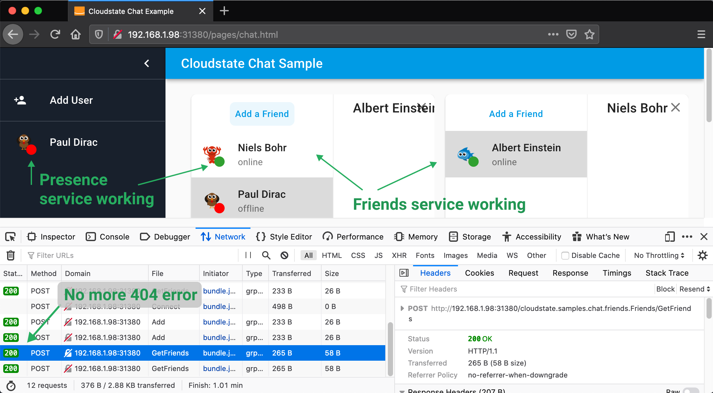

= Deploy Cloudstate Chat sample on own Kubernetes
Lightbend, 2020
Version 2.0, 2020-07-15
:description: Cloudstate Chat Application 
:keywords: Cloudstate, stateful, serverless, chat-sample, tutorial
:sectnums:
:toc:
ifdef::env-github[]
:tip-caption: :bulb:
:note-caption: :information_source:
:important-caption: :heavy_exclamation_mark:
:caution-caption: :fire:
:warning-caption: :warning:
endif::[]

== Overview

We have built the docker images of the microservices composing the <<../README.adoc#,Chat application>>. Now we are going to deploy these services on our own Kubernetes cluster. 

Then we will reward ourselves with a test to see our services piecing together to form a coherent application. In particular, we will verify the statefulness ability brought to our application thanks to Cloudstate. More exactly, our application can store and retrieve state and yet we didn't write any code for state management.

== Which Kubernetes flavor?

By choosing to deploy on your own Kubernetes cluster, it is assumed that:

* you have a Kubernetes cluster ready and you are familiar with https://kubernetes.io/docs/concepts/[Kubernetes concepts]
* you are comfortable using the https://kubernetes.io/docs/reference/kubectl/overview/[kubectl] tool
* you have admin privilege on the Kubernetes cluster

For the Chat application sample, we will select an arbitratry configuration which is reasonably within the reach of a local development environment. However, the deployment approach is close to that of a production deployment:

* Single node Kubernetes cluster, outside of the dev machine. Outside means the cluster doesn't share the same network namespace as the dev machine. In plain terms, this means the cluster is not installed on your dev machine. This is important to highlight the difficulty and precaution when exposing Kubernetes services.

* https://istio.io/latest/docs/concepts/what-is-istio/[Istio] is selected as ingress controller. More on this topic <<need-of-ingress-controller,later>>

We cannot cover many possible variations of roll-your-own Kubernetes cluster and add-ons. In case your infrastructure differ from the arbitrary choice made in this guide. You should work out by yourself to adjust for the differences.

== Install Cloudstate operator

To deploy your Cloudstate-aware services on your own Kubernetes cluster. You must install the **Cloudstate operator** (cluster admin permission is required). The Cloudstate operator is responsible for:

* transforming a Cloudstate yaml config into a Kubernetes deployment.
* injecting a Cloudstate proxy as sidecar container along with the container of your own service

For further documentation, read https://github.com/cloudstateio/cloudstate#design-and-architecture[Cloudstate Design and Architecture] and https://cloudstate.io/docs/core/current/user/deployment/index.html[Cloudstate, Deploying applications]

.Install Cloudstate Operator, minimum version required `0.5.1`
[source,shell]
----
# create a Kubernetes namespace dedicated to all resources specific to cloudstate.io
# for simplicity, let's name it `cloudstate`
kubectl create namespace cloudstate

# install the Cloudstate operator
kubectl apply -n cloudstate -f https://raw.githubusercontent.com/cloudstateio/cloudstate/v0.5.1/operator/cloudstate.yaml

# verification
$ kubectl api-resources --api-group=cloudstate.io

# console output must show:
NAME               SHORTNAMES   APIGROUP        NAMESPACED   KIND
statefulservices                cloudstate.io   true         StatefulService
statefulstores                  cloudstate.io   true         StatefulStore
----

== Deployment

[[choice-k8s-namespace]]
=== Choice of Kubernetes namespace

On which https://kubernetes.io/docs/concepts/overview/working-with-objects/namespaces/[namespace] in your Kubernetes cluster that you would like to deploy the Chat application?

[source,shell]
----
# list all namespaces
$ kubectl get namespaces

# what is your current namespace?
$ kubectl config view --minify --output 'jsonpath={..namespace}'
----

If you are OK to use the current namespace then skip to next step. In this guide, we choose to create a new namespace. To better isolate the Chat application deployment from those which may already exist in your cluster.

[source,shell]
----
$ kubectl create namespace mychatapp
----

The newly created namespace `mychatapp` is not the current namespace. ie. you would need to specify the namespace in every `kubectl` command with `-n mychatapp`. To avoid this extra typing, we set `mychatapp` as the current namespace: 

[source,shell]
----
$ kubectl config set-context --current --namespace=mychatapp
----

For the rest of the deployment steps, the `kubectl` commands will skip the `-n` option to indicate the target namespace. It is assumed that you have already selected your current namespace.

=== Deployment YAML files

The `./deploy/*.yaml` files are configured by default to use the prebuilt docker images stored in the `cloudstateio` registry on docker hub.

We went through the troubles of building, testing and publishing the docker images of our services. Let's reward ourself by using our own docker image instead. Edit the following yaml files:

* https://github.com/cloudstateio/samples-ui-chat/blob/master/deploy/chat-ui.yaml[chat-ui.yaml]
* https://github.com/cloudstateio/samples-ui-chat/blob/master/deploy/friends.yaml[friends.yaml]
* https://github.com/cloudstateio/samples-ui-chat/blob/master/deploy/presence.yaml[presence.yaml]

Let's assume your DockerID is `mydockerregistry`. In each of the above yaml, replace `image: cloudstateio/` by `image: mydockerregistry/`

[source,shell]
----
# change
spec:
  containers:
  - image: cloudstateio/samples-js-chat-ui:latest

# to
spec:
  containers:
  - image: mydockerregistry/samples-js-chat-ui:latest
----

=== Deploy services on your Kubernetes cluster

[source,shell]
----
$ cd ./deploy

$ kubectl apply -f chat-ui.yaml
$ kubectl apply -f friends.yaml
$ kubectl apply -f presence.yaml
----

Wait maybe 1 minute for the cluster to spin up resources and start up all the services. Then check that the services are correctly deployed:

[[check-chatapp-deployment]]
=== Checking the deployment

==== Cloudstate StatefulService

The YAML files represent the description of a `cloudstate.io` resource of type `StatefulService`. We should see all the 3 services:

[source,shell]
----
$ kubectl get statefulservices

# console output:
NAME       AGE
chat-ui    95s
friends    66s
presence   35s
----

==== Pod resources

The cluster must allocate the corresponding compute resources, which are Kubernetes pods. Notice `2/2` in the `READY` column. This means each pod has 2 containers and all 2 are running OK. For now let's skip this detail. We will discuss about the containers later.

[source,shell]
----
# option `-l cloudstate.io/statefulService` : show only the pods related to the Chat app
$ kubectl get pods -l cloudstate.io/statefulService

# console output:
NAME                                   READY   STATUS    RESTARTS   AGE
chat-ui-deployment-97f88f44d-2qqzc     2/2     Running   0          2m8s
friends-deployment-6479c6f54c-4blxr    2/2     Running   0          99s
presence-deployment-585d7cfc44-27rvv   2/2     Running   0          68s
----

[[kubernetes-chatapp-services]]
==== Kubernetes services

Each Cloudstate StatefulService is backed by a Kubernetes service resource. We must also see 3 services.

[source,shell]
----
# option `-l app.kubernetes.io/managed-by=cloudstate.io` : show only the "Cloudstate-aware" services
$ kubectl get services -l app.kubernetes.io/managed-by=cloudstate.io

# console output:
NAME       TYPE        CLUSTER-IP       EXTERNAL-IP   PORT(S)   AGE
chat-ui    ClusterIP   10.152.183.115   <none>        80/TCP    3m44s
friends    ClusterIP   10.152.183.44    <none>        80/TCP    3m15s
presence   ClusterIP   10.152.183.56    <none>        80/TCP    2m44s
----

== Testing - Some failed attemps

By design, the route to access the Chat UI is `/pages/chat.html`. 

We are going to try several approaches to access the services of the Chat application. Warming up with some "bad practices" which will fail. Because things get more complicate when we step outside of the happy path "everything running in localhost". Through the errors, we will learn about the complexity of service discovery and how Kubernetes and an ingress controller help to solve the problem. Along the road we will also learn some good security practices.

=== Access Chat UI directly by the endpoint of the chat-ui service 

Here we want to make a quick test, ignoring security measures. We gain access to a physical node in the cluster. Open a browser and access the chat UI directly through the Pod where the chat container is physically deployed. For this, we need to know the endpoint of the `chat-ui` service:

[source,shell]
----
$ kubectl get endpoints

NAME       ENDPOINTS         AGE
chat-ui    10.1.4.140:8013   36m
friends    10.1.4.138:8013   35m
presence   10.1.4.143:8013   35m
----

`10.1.4.140:8013` is the entrypoint of the `chat-ui` service. We know `/pages/chat.html` is the route to the chat UI. So the URL to the Chat application is `http://10.1.4.140:8013/pages/chat.html`

`10.1.4.140` is the IP address of the pod where the `chat-ui` service has been deployed. This address is in the network namespace of the Kubernetes cluster. We can only test it FROM WITHIN the cluster. SSH into one of the node in the cluster and make a REST request using `curl`

[source,shell]
----
$ curl --silent http://10.1.4.140:8013/pages/chat.html | grep -E "<title>.+"

# console output
<title>Cloudstate Chat Example</title>
----

Good! the Chat home page is responding. But we still need to verify the full application logic. It would be quite impractical to make such test using `curl`. So now let's try to open the Chat URL in a browser:

* Like with `curl`, the browser must be run from a node within the cluster
* Open in advance the Web Developer, Network tool
* Open the ChatUI `http://10.1.4.140:8013/pages/chat.html`

We see a nice homepage which indicates that our `chat-ui` service is working. Let's connect a new user in the chatroom. In the background, the UI makes some service calls:

* Query the `friends` service to get the user friends list
* Query the `presence` service to assess the online/offline status

In the screenshot below, the Network tool shows both calls had failed with `404 Not Found`

*Why 404?*

The `chat-ui` knows via the https://github.com/cloudstateio/samples-js-chat/blob/master/friends/friends.proto[Friends service descriptor] that the RPC method `GetFriends` is fully qualified as `cloudstate.samples.chat.friends.Friends/GetFriends`. The `chat-ui` just invokes the `GetFriends` method via that route, assuming it resides on the same host.

However, we have chosen to deploy the each service as a separate microservice. Therefore each of these services has a different endpoint. The `chat-ui` service could not know where the other services have been deployed. Hence the `404 Not Found` HTTP error.

=== Access chat-ui service on its ClusterIP

Accessing a service directly at the pod IP address in the previous attempt has another inconvenience. A pod is ephemeral. For various reasons, hardware resources, scaling up/down, etc. Kubernetes could redeploy the service on a new pod with a different IP address. Kubernetes service is designed to address this problem. Clients access the service through a stable IP address and port. Behind the scene, Kubernetes will route the request to one of the pods backing the service.

Let's use the Cluster-IP which is the stable IP address where the `chat-ui` service is exposed. In <<kubernetes-chatapp-services,Checking Kubernetes services>>, we saw:

----
NAME       TYPE        CLUSTER-IP       EXTERNAL-IP   PORT(S)   AGE
chat-ui    ClusterIP   10.152.183.115   <none>        80/TCP    3m44s
----

`10.152.183.115` is the stable IP address where the `chat-ui` service is exposed. Conveniently, the service deployment was configured to listen on port `80`). This IP is called the ClusterIP which is accessible by any resource within the cluster. However a ClusterIP is not routable outside of the cluster. Therefore to test the URL, we must open the browser from a machine located within the cluster. The URL this time is simpler: `http://10.152.183.115/pages/chat.html`

Unfortunately, we get exactly the same `404 Not Found` error as the previous test. For the exact same reason.

=== Other "bad" ways to access chat-ui service

At this point, you realize that it is not a wise idea to gain control of a node in the cluster. And even worse, to launch an interactive process requiring graphical resources, like starting a browser. Fair enough, let's test from the outside of the cluster. You may have known of some methods to expose a service outside of a Kubernetes cluster:

* Using `kubectl proxy` to access the  Kubernetes ApiServer.
* Using `kubectl port-forwarding` to forward a local IP and port to a port on a Pod in the cluster.

These methods are not discussed in this guide. First, because they are unsafe. They require a running `kubectl` session to authenticate and connect to the Kubernetes cluster. Secondly, in case you insist on trying out, you will get exactly the same failure as the two previous attempts. The Chat UI home page will display OK. But requests to `Friends` or `Presence` services will fail by `404 Not Found`.

Next, you might be tempted by a "safer" method, by exposing the service through the `NodePort` service type. This is indeed safer than the  `kubectl xxx` methods above. But still unsafe, because NodePort will open the same port on ALL nodes, bypassing almost all network security in Kubernetes. More detailed technical reasons: https://oteemo.com/2017/12/12/think-nodeport-kubernetes/[Think Before you NodePort in Kubernetes].

Exposing services via NodePort type will not be presented either. In case you are brave enough to attempt the experiment. After all, this is your local dev environment, you may accept some lax about security. By editing the service config to change the `type` to `NodePort`. This will still fail, again, for exactly the same reason (homepage OK, but 404 when invoking dependent services).

[[need-of-ingress-controller]]
== The need of an Ingress controller to route HTTP traffic

In the previous tests, the Chat UI failed by `404 Not Found` when trying to invoke the `friends` and `presence` services. This is because the Javascript code of the `chat-ui` service has no way to know the location of those dependent services. It just assumes those services reside on the same host. There is a need for a kind of "gateway" to route the service requests to the correct endpoints.

The "gateway", termed generically vague which we will define later in more details, must fulfill the following requirements:

* Be accessible through a single IP address, even though the services behind are served on different IP addresses. 
* Be able to route traffic based on the HTTP path.
* Be able to handle HTTP 1.1 (web UI) and HTTP/2 (grpc)

The solution is to use an https://kubernetes.io/docs/concepts/services-networking/ingress/[ingress]. An ingress operates at the application layer, aka https://en.wikipedia.org/wiki/List_of_network_protocols_(OSI_model)#Layer_7_(Application_Layer)[Layer 7 in network protocols)]. In our case, the ingress understands the structure of the HTTP data packet, determines the hosts and paths in the request, and routes the traffic to the appropriate Kubernetes service.

There is a large list of choices for https://kubernetes.io/docs/concepts/services-networking/ingress-controllers/[ingress controllers]. For a small local dev Kubernetes cluster, Nginx-ingress and Istio are popular open-source options available for https://minikube.sigs.k8s.io/docs/commands/addons/[Minikube] and https://microk8s.io/docs/addons[MicroK8S]. Each ingress controller has a different setup and configuration. But the overall configuration follows the same principles:

* Define the incoming traffic: eg. host ["a", "b", "c"], http, port 80
* Define the http routes: eg. if path is `/hello/userA`, then forward to service `Welcome` at `port 7890`

== Istio installation

To illustrate by a concrete example, we choose Istio which is a service mesh. Istio has many powerful features above a bare minimum ingress controller:

* Automatic load balancing for HTTP, gRPC, WebSocket, and TCP traffic.
* Fine-grained control of traffic behavior, enabling A/B testing, canary rollouts, rate limiting, quotas, retries, failover, fault injection, etc.
* Monitoring metrics and logging
* Authentication, access controls, rate limits, quotas
* For more details: https://istio.io/latest/docs/concepts/what-is-istio/[What is Istio?]

Istio can be installed on a large number of platforms. For local dev Kubernetes cluster the popular choice would be likely

* https://medium.com/faun/istio-step-by-step-part-10-installing-istio-1-4-in-minikube-ebce9a4e99c[Minikube]
* https://istio.io/latest/docs/setup/platform-setup/microk8s/[MicroK8s enable Istio add-on]
* https://istio.io/latest/docs/setup/getting-started/[Manual installation]

=== Preparing the Kubernetes namespace to be Istio aware

Istio functionalities are made possible through an "Envoy proxy" (for more details: https://istio.io/latest/docs/ops/deployment/architecture/[Istio architecture]). The Envoy proxy must be deployed, as a https://www.magalix.com/blog/the-sidecar-pattern["sidecar" container], in the same pod as your service. This task is handled by the Istio daemon. However it is disabled by default. You should enable the injection of the Envoy proxy sidecar when you deploy your service. By setting a specific label in the https://kubernetes.io/docs/concepts/overview/working-with-objects/namespaces/[Kubernetes namespace] within which your services are deployed. 

In <<choice-k8s-namespace,Choice of Kubernetes namespace>>, we have chosen `mychatapp` as namespace. But yours could be `default` if you have chosen not to create a specific namespace to deploy the Chat application.

[source,shell]
----
# enable Envoy proxy sidecar in the namespace
$ kubectl label namespace mychatapp istio-injection=enabled

# verification:
$ kubectl get namespace mychatapp --show-labels

# console output
NAME        STATUS   AGE     LABELS
mychatapp   Active   5d18h   istio-injection=enabled
----

== Re-deploy the Chat application

=== Delete + Deploy all services

The Chat, Friends, Presence services we have deployed so far are not Istio-aware. The pods in which those services were deployed didn't have yet the Envoy proxy container sidecar. To force the injection of the Envoy proxy sidecar, the entire Chat application needs to be deleted first, and then redeployed.

[source,shell]
----
$ cd ./deploy

$ kubectl delete -f chat-ui.yaml
$ kubectl delete -f friends.yaml
$ kubectl delete -f presence.yaml

$ kubectl apply -f chat-ui.yaml
$ kubectl apply -f friends.yaml
$ kubectl apply -f presence.yaml
----

We can verify the deployement as described in <<check-chatapp-deployment,Checking the deployment>>. But here in particular, we want to verify if Istio has injected the Envoy proxy sidecar in the pod of each of our services:

[source,shell]
----
$ kubectl get pods -l cloudstate.io/statefulService

NAME                                  READY   STATUS    RESTARTS   AGE
chat-ui-deployment-65945cfd95-mcbdz   3/3     Running   0          3m32s
friends-deployment-6db699d677-jrkw7   3/3     Running   0          3m13s
presence-deployment-bb58cdc98-5dq6t   3/3     Running   0          2m37s
----

Notice the the `READY` column which now contains the value `3/3`, it was `2/2` when Istio was not yet enabled. This means the pod has 3 containers, and all 3 are running OK. Let's see what are those 3 containers, for example, in the pod where the `chat-ui` service  was deployed:

[source,shell]
----
# list of containers running in the pod where `chat-ui` was deployed
$ kubectl get pod -l app=chat-ui -o jsonpath='{range .items[0].spec.containers[*]}{.name}{"\n"}'

# console output
user-container
akka-sidecar
istio-proxy
----

[horizontal]
user-container::
is the Cloudstate "user-function" ie, the service of the business logic you wrote. Here it is the frontend web application written in TypeScript. It is backed by a Cloudstate `stateless` service that will serve the compiled Javacript, html and images.

akka-sidecar:: is the Cloudstate proxy which takes care of the state management for the Cloudstate "user-function". This sidecar container was injected by the Cloudstate operator. The role of this Cloudstate proxy sidecar is explained in detail in the https://github.com/cloudstateio/samples-js-chat/blob/master/friends/README.adoc#testing-friends-service[programming tutorial of the Friends service] 

istio-proxy:: is the Envoy proxy sidecar, injected by the Istio ingress controller.

=== Istio configuration

Istio now sits between the browser and the services. It can intercept the incoming requests and forward to the appropriate services. For this to happen, we need to configure Istio:

* To define which traffic is allowed
* Once allowed, we reach further in the network stack, at the application level, to define the *routing rules*

In Kubernetes terms, this means the Istio ingress controller requires the configuration of 2 resources:

https://istio.io/latest/docs/concepts/traffic-management/#gateways[Gateway]::
describes a load balancer operating at the edge of the mesh receiving incoming or outgoing HTTP/TCP connections. The specification describes a set of ports that should be exposed, the type of protocol to use, SNI configuration for the load balancer, etc.

https://istio.io/latest/docs/concepts/traffic-management/#virtual-services[VirtualService]::
define routing rules, forwarding of traffic arriving at a particular host to the appropriate Kubernetes services. All the feature-rich service-level controls are also configured in the VirtualService.
+
{nbsp} +

=== Deploy Istio configuration

For our Chat application, the Istio's Gateway and VirtualService are configured in the same file https://github.com/cloudstateio/samples-ui-chat/blob/master/deploy/chat-ui.yaml[localk8s_istio.yaml]. The configuration is very simple as it is quite bare minimum:

* Use the default ingress gateway (no need to define a custom gateway controller) 
* Accept all HTTP traffic on port 80 for all hosts (`host = "*"`)
* To configure `host` and `port number` of the routing rules in istio's `VirtualService`, we must get the info from `kubectl get services` which we have seen in <<kubernetes-chatapp-services,Checking Kubernetes services>>. The term `host` is generic to Istio/Envoy. In the context of Kubernetes, `host` means the Kubernetes service name. Repeated here for convenience:

[source,shell]
----
$ kubectl get services -l app.kubernetes.io/managed-by=cloudstate.io

NAME       TYPE        CLUSTER-IP       EXTERNAL-IP   PORT(S)   AGE
chat-ui    ClusterIP   10.152.183.115   <none>        80/TCP    3m44s
friends    ClusterIP   10.152.183.44    <none>        80/TCP    3m15s
presence   ClusterIP   10.152.183.56    <none>        80/TCP    2m44s
----

* The column `NAME` is the Kubernetes service name which is used (case sensitive) as `destination.host` in Istio's VirtualService
* The column `PORT(S)` is the port number through which the Kubernetes service is exposed. This is used to configure `destination.port.number` in Istio's VirtualService
* Port `80` is default for `http`, this is why it is optional in the routing rule. The config is commented out as a reminder.

Now we can deploy the Istio configuration by:

[source,shell]
----
$ kubectl apply -f localk8s_istio.yaml

# console output
gateway.networking.istio.io/chat-gateway created
virtualservice.networking.istio.io/chat-virtsvc created
----

== Testing from outside of the cluster

=== What is the URL to the Chat-UI?

Now our Chat application is ready for testing, but what is the URL to access the Chat UI?

We have deployed an Istio VirtualService named `chat-virtsvc` which defines the routing rules. This VirtualService depends on the `ingressgateway` resource which controls the ingress traffic. This means the `ingressgateway` is the entry point to access the Chat UI. To access this entry point from the outside of the cluster, we need to know the components of the URI:

* By design, the chat UI is accessible by http, port 80 at the route `/pages/chat.html`
* The IP address of the host (ie. the Kubernetes node) on which the `ingressgateway` was deployed:
+
[source,shell]
----
$ export INGRESS_HOST=$(kubectl get pod -l istio=ingressgateway \
  -n istio-system -o jsonpath='{.items[0].status.hostIP}')
----
* The nodePort through which the `istio-ingressgateway` service is listening for http traffic:
+
[source,shell]
----
$ export INGRESS_PORT=$(kubectl -n istio-system \
  get service istio-ingressgateway \
  -o jsonpath='{.spec.ports[?(@.name=="http2")].nodePort}')
----
* The URL to the Chat UI would be:
+
[source,shell]
----
$ echo http://$INGRESS_HOST:$INGRESS_PORT/pages/chat.html

# Example of console output
http://192.168.1.98:31380/pages/chat.html
----

=== Testing the Chat application

* Use a computer OUTSIDE of the Kubernetes cluster
* Open in a browser the URL given by `http://$INGRESS_HOST:$INGRESS_PORT/pages/chat.html` as seen above
* The chat application is fully functional: you can connect a couple of users, add friends, disconnect/reconnect users.
* The navigation guide is explained at <<../README.adoc#chatui-navigation-guide,Chat navigation guide>>
+
{nbsp} +

*(end)*
